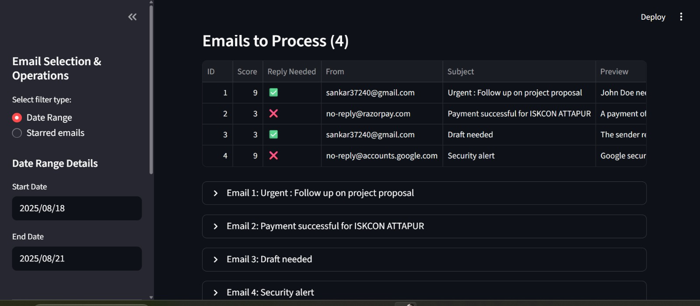
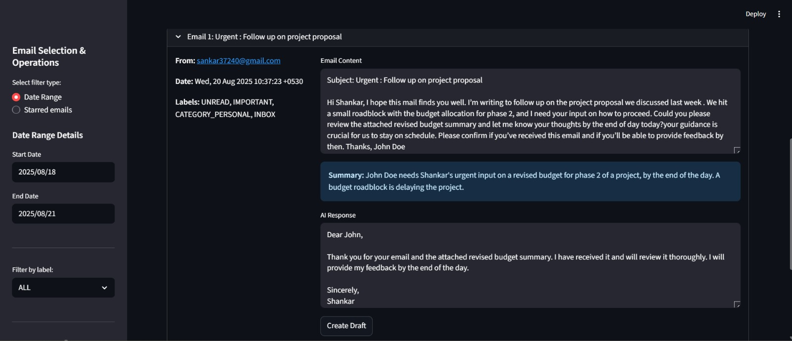
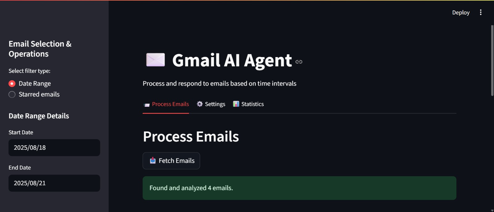

# Gmail Pydantic AI Agent

This project implements an intelligent AI agent using Pydantic AI to manage Gmail accounts. The agent can:
- Process starred emails with unread messages
- Generate dynamic replies using AI language models
- Send replies to the latest messages in email threads
- Ignore spam and promotional emails
- Intelligently track and avoid duplicate replies

## Key Features

- **Smart Email Processing**: Processes starred emails with unread messages
- ✅ **Draft Mode**: Creates draft replies for your review instead of sending automatically
- **Conversation-Aware**: Identifies and responds to the most recent unread message in ongoing conversations
- **Thread Intelligence**: Properly handles multi-message threads and conversation history
- **Threaded Replies**: Replies are sent in the same thread as the original message for better conversation tracking
- **Duplicate Prevention**: Multiple safeguards to prevent duplicate replies:
  - Checks if the latest message is from the agent
  - Only processes messages with the UNREAD label
  - Removes stars after processing to prevent reprocessing
- **Automatic Star Management**: Removes stars after processing to prevent duplicate replies
- **Flexible Model Support**: Works with any good model via OpenRouter

## Installation

1. Install dependencies:
```bash
pip install google-auth google-auth-oauthlib google-auth-httplib2 google-api-python-client httpx pydantic-ai python-dotenv aiohttp
```

2. Set up Environment Variables:
   - Rename the example file:
```bash
curl -o .env .env.example
```
   - Replace the placeholder with your actual API key:
```bash
MY_OPENROUTER_API_KEY=your_openrouter_api_key_here
```
   - Configure operation mode (draft by default):
```bash
# Options: 'auto' (send automatically), 'draft' (create drafts for review)
OPERATION_MODE=draft
```

### Setting Up Google OAuth Credentials

To enable Gmail API access, you'll need to set up OAuth credentials through Google Cloud Console:

1. **Create a Google Cloud Project**:
   - Go to [Google Cloud Console](https://console.cloud.google.com/)
   - Click "Create Project"
   - Give your project a name and click "Create"

2. **Enable Gmail API**:
   - In the left sidebar, go to "APIs & Services" → "Library"
   - Search for "Gmail API" and click on it
   - Click "Enable"

3. **Configure OAuth Consent Screen**:
   - Go to "APIs & Services" → "OAuth consent screen"
   - Select "External" and click "Create"
   - Fill in the required app information:
     - App name: Your application name
     - User support email: Your email address
     - Developer contact information: Your email address
   - Click "Save and Continue"
   - Add any required scopes (you can skip this for now)
   - Add test users (add your own email address)
   - Click "Save and Continue"

4. **Create OAuth Credentials**:
   - Go to "APIs & Services" → "Credentials"
   - Click "Create Credentials" → "OAuth client ID"
   - Select "Desktop app" as the application type
   - Give it a name and click "Create"
   - Download the credentials file and save it as `credentials.json` in your project directory

5. **Authorize Your Application**:
   - Run the provided `get_tokens.py` script:
```bash
python get_tokens.py
```
   - Follow the authorization flow in your browser
   - The tokens will be saved to `token.json`

## Usage

Run the agent:
```bash
python gmail_agent.py
```

The agent will:
1. Authenticate with Gmail using the provided token
2. Find all starred emails
3. For each starred email:
   - Check if any message in the thread is unread
   - Skip if the latest message is from the agent (already replied)
   - Skip if there are no unread messages in the thread
   - Find the most recent unread message to respond to
   - Generate a detailed, helpful reply in the same language as the original message
   - Create a draft or send the reply based on the OPERATION_MODE setting
   - Remove the star after processing to prevent duplicate replies
4. Ignore unwanted emails

### Operation Modes 🆕 

The agent supports two operation modes, configurable via the `.env` file:

1. **Draft Mode** (Default): Creates draft emails for your review
   - Ideal for reviewing AI-generated replies before sending
   - Allows you to make edits or discard inappropriate responses
   - Set `OPERATION_MODE=draft` in your `.env` file

2. **Auto Mode**: Sends replies automatically without review
   - Useful for fully automated email management
   - Best for low-stakes email replies or when you fully trust the AI
   - Set `OPERATION_MODE=auto` in your `.env` file

## Workflow

1. **Star Important Emails**: Star any email you want the agent to process
2. **Run the Agent**: The agent will process starred emails with unread messages
3. **Automatic Star Removal**: Stars are removed after processing to prevent duplicate replies
4. **Ongoing Conversations**: 
   - To continue a conversation, mark new messages as unread
   - Star the conversation again if you want the agent to respond to new messages
   - The agent will only respond to unread messages, preventing duplicate replies




## Configuration

The agent can be scheduled to run regularly:
- Use a cron job or task scheduler
- Set it to run at your preferred time

You can customize the agent's behavior:
- Set `OPERATION_MODE=draft` or `OPERATION_MODE=auto` in your `.env` file
- Change the AI model in the `OpenRouterAPI` class (currently using "google/gemini-2.0-flash-001")
- Modify the system prompt in the `Agent` initialization
- Adjust the reply generation prompt in the main function

## Enhanced Response Logic

The agent uses a prompt system to generate rich, detailed responses:

1. **Comprehensive Responses**: Generates detailed replies (3-5 sentences minimum) rather than brief answers
2. **Language Matching**: Automatically responds in the same language as the original email
3. **Context-Aware Replies**: Adapts responses based on whether the email is a question, request, or statement
4. **Warm, Professional Tone**: Maintains a friendly yet professional tone in all communications
5. **Appropriate Formatting**: Uses suitable greetings and sign-offs based on the formality of the original email

## Demo: See the Agent in Action

Here are real examples of how the Gmail Pydantic AI Agent responds to various types of emails:

### Example 1: Meeting Request

**Incoming Email from FaustoS88:**
```
Subject: Quick question about your availability

Hi there,

I was wondering if you're available for a quick call sometime next week to discuss the project? I have a few questions that would be easier to talk through than explain via email.

Let me know what days/times work best for you.

Thanks!
Alex
```

**Agent's Response:**
```
Subject: Re: Quick call next week

Hi Alex,

Thanks for reaching out! I'd be happy to schedule a quick call next week to discuss the project and answer your questions. Talking things through is often much more efficient, I agree.

To help me find a time that works best for both of us, could you please let me know what days and times next week you're generally available? Once I have that information, I can check my calendar and send you a meeting invite.

Looking forward to our chat!

Best regards,
Sofia
```

### Example 2: Technical Support Issue

**Incoming Email from FaustoS88:**
```
Subject: API Integration Issues with Auth0

Hello Support Team,

I'm experiencing issues integrating your REST API with our Auth0 authentication system. When I attempt to make a GET request to the /users endpoint with the JWT token in the Authorization header, I'm receiving a 401 Unauthorized error.

Here's what I've tried so far:
1. Verified the JWT token is valid using jwt.io
2. Confirmed the token hasn't expired
3. Double-checked that all required scopes are included
4. Added the 'Bearer ' prefix to the token

Could you please advise on what might be going wrong? I've attached the error logs for reference.

Thank you,
Morgan Reynolds
Senior Developer
```

**Agent's Response:**
```
Subject: Re: REST API Integration Issue with Auth0

Hello!

Thank you for reaching out to us regarding the integration issue you're experiencing with our REST API and Auth0. I understand you're having trouble making a GET request to the `/users` endpoint using the JWT token. I'm happy to help you sort this out!

To best assist you in resolving this issue, could you please provide a few more details about your setup? Specifically, it would be helpful to know:

*   **The exact error message you are receiving:** This will give me a more precise understanding of what's going wrong.
*   **How you are configuring the authorization header in your request:** Please confirm you are setting the header as `Authorization: Bearer <your_jwt_token>`.
*   **Whether you've configured the necessary permissions (scopes/claims) in your Auth0 application:** Our API might require specific scopes within the JWT to authorize access to the `/users` endpoint.
*   **A code snippet (if possible) showing how you are making the API call:** This will help me identify any potential issues in your code.

In the meantime, here are a few general troubleshooting steps you can try:
1.  **Verify the JWT token:** Ensure the token is valid and hasn't expired. You can use websites like jwt.io to decode and inspect the token's contents.
2.  **Check Auth0 Application Settings:** Confirm that your Auth0 application is authorized to access the required resources.
3.  **Review API Documentation:** Double-check our API documentation to ensure you are following the correct authentication procedures and required headers.

Once I have the additional details, I can provide more specific guidance. We're here to help you get this integration working smoothly!

Best regards,
Sofia
Support Team
```

### Example 3: Production Issue Alert

**Incoming Email from FaustoS88:**
```
Subject: Critical Bug in Production: Database Connection Timeout

PRIORITY: HIGH

Team,

We're experiencing intermittent database connection timeouts in the production environment since deploying version 2.5.3 this morning. The issue appears to be affecting approximately 15% of user transactions.

Error details:
- Connection timeout after 30 seconds
- No corresponding spike in database CPU or memory usage
- Error occurs randomly across different query types
- No pattern related to load volumes

We've temporarily rolled back to 2.5.2 to stabilize the system, but need to identify the root cause before attempting to deploy again.

Could you please review the connection pooling changes that were introduced in 2.5.3? Specifically, the modifications to connection_pool.js might be relevant.

Logs and monitoring data are available in the #prod-issues Slack channel.

Regards,
DevOps Team
```

**Agent's Response:**
```
Subject: Re: Production Database Connection Timeouts

Hi Team,

Thanks for bringing this to my attention so quickly! I understand that we're experiencing intermittent database connection timeouts in the production environment since deploying version 2.5.3 this morning, and that this is a high-priority issue.

I'll immediately start investigating this. My first step will be to check the database server's resource utilization (CPU, memory, disk I/O) and network connectivity to identify any bottlenecks. I'll also review the application logs for any specific error messages related to the database connections.

In the meantime, could you please share any specific error messages or log snippets you've observed? This information will be invaluable in pinpointing the root cause.

I'll keep you updated on my progress and will work to resolve this as quickly as possible.

Best,
Sofia
```

### Example 4: Code Review Request

**Incoming Email from FaustoS88:**
```
Subject: Code Review Request: Payment Processing Module

Hi Dev Team,

I've completed the initial implementation of the payment processing module and would appreciate your review before I merge it into the develop branch.

Key changes:
- Implemented Stripe and PayPal payment gateways
- Added encryption for stored payment methods
- Created abstract factory pattern for payment processor selection
- Added comprehensive unit tests (coverage at 94%)

GitHub PR: https://github.com/company/project/pull/1337

Some specific areas I'd like feedback on:
1. Is the abstraction layer flexible enough for adding new payment providers?
2. Are there any security concerns with the way credentials are handled?
3. Is the error handling comprehensive enough for production use?

Thanks in advance!
Jordan
```

**Agent's Response:**
```
Subject: Re: Payment Processing Module Implementation

Hi there!

That's fantastic news! Thank you so much for completing the initial implementation of the payment processing module. We really appreciate you taking the initiative to implement Stripe – that's going to be a huge improvement for our payment system.

We're happy to review the code before you merge it into the develop branch. To help us with the review process, could you please create a pull request on our repository targeting the 'develop' branch? Please also include a detailed description of the implementation, any specific areas you'd like us to focus on, and any testing you've already performed. This will help us provide more targeted and efficient feedback.

Once the pull request is ready, please let us know, and we'll schedule some time to review it. We're excited to see the new module in action!

Thanks again for all your hard work!

Best regards,
Sofia
```

## Example Response Types:

- **For Questions**: Provides thorough answers with examples or steps when relevant
- **For Requests**: Acknowledges the request clearly and provides next steps or confirmation
- **For Updates**: Acknowledges the information and responds appropriately
- **For Problems**: Maintains a positive, supportive tone even when addressing issues

## 🚀 Coming Soon: Premium Features

We're actively developing enhanced capabilities for the Gmail Pydantic AI Agent that will take your email management to the next level. Here's a sneak peek at what's coming:

### 1. Enhanced Email Intelligence
- **Smart Categorization**: Automatically classifies emails by type, urgency, and content
- **Priority Processing**: Intelligently prioritizes emails based on sender, content, and time sensitivity
- **Sentiment Analysis**: Detects the tone and emotion of incoming messages for more appropriate responses

### 2. Memory & Contextual Understanding
- ✅ **Conversation Memory**: Maintains context across multiple email exchanges
- ✅ **Entity Recognition**: Identifies and remembers important people, projects, and topics
- ✅ **Relationship Tracking**: Builds a network of connections between correspondents and topics

### 3. Knowledge Base Integration
- **FAQ Integration**: Automatically answers common questions with consistent, accurate responses
- **Template System**: Dynamic response templates for different types of emails
- **Customizable Response Styles**: Personalize how your AI assistant communicates

### 4. Proactive Email Management
- **Smart Follow-up System**: Automatically schedules and sends follow-up emails for important conversations
- **Action Item Detection**: Identifies tasks and requests within emails
- **Calendar Integration**: Extracts meeting requests and schedules them on your calendar

### 5. Advanced Analytics & Reporting
- **Email Analytics Dashboard**: Visualize your email patterns and assistant performance
- **Response Time Tracking**: Monitor how quickly emails are being handled
- **Usage Reports**: Get insights into how the assistant is saving you time

### 6. Enterprise-Ready Features
- **Multi-Account Support**: Manage multiple email accounts with a single agent
- **Team Collaboration**: Share knowledge bases and templates across a team
- **Custom Integration APIs**: Connect with your existing tools and workflows

⭐ **Star this repository to stay updated on these exciting new features!** ⭐

We're committed to making this the most powerful open-source email assistant available. Community feedback and contributions help us prioritize the most valuable features.

## Premium Support

For organizations and power users who need advanced features or custom development, premium support options will be available. Contact us for more information on enterprise licensing and custom deployments.

## Requirements

- Python 3.8+
- Valid Gmail OAuth token
- OpenRouter API key (or other LLM API access)
